## **Week 11**

#### Tasks completed:
- Categorisation of flares by peak number and Pearson r
- Found approx. FWHM of pulses (Scipy peak_widths), rise/decay times, peak separations
- More flare statistics and correlation plots

#### Results/Figures:
- ##### Flare categorisation: 
  - Categorising flares into **simple** (<3 peaks or Pearson r with SEA median >0.7) or **complex** (3+ peaks or Pearson r with SEA  median <0.7), there are ~90/150 flares that both methods agree on.
 
  - *An agreed simple flare:*
    
  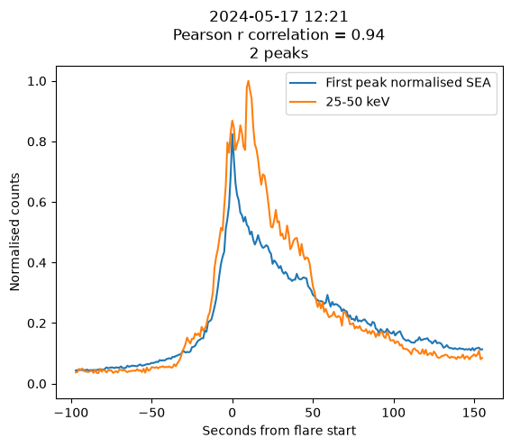

  - *An agreed complex flare:*
  
  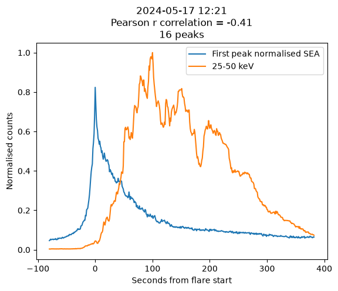

  - *A mixed flare: High correlation, but many peaks*

  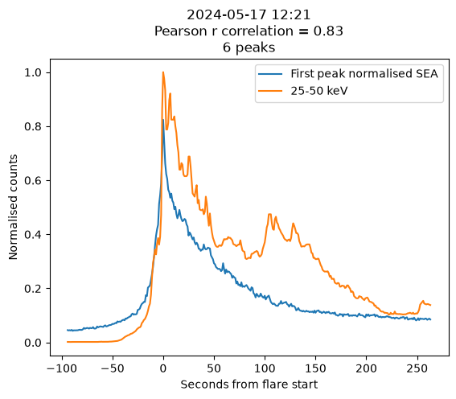

- ##### Pulse FWHM and separation:
  - I used Scipy peak_widths at a relative height of 0.5 as the simplest way to assess a proxy FWHM over a large sample of pulses, and took the pulse separation as simply the distance between peaks found by Scipy find_peaks. 

    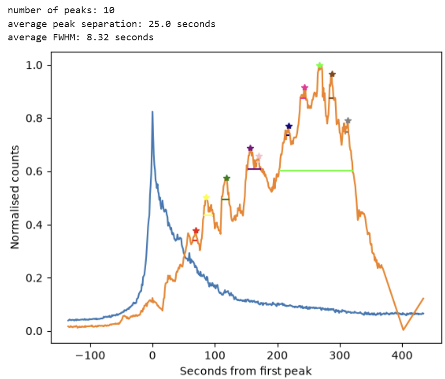

  - Using this method gives a mean peak width across all flares of 32.5 seconds, which agrees well with the FWHM of the SEA median flare of 29.4 seconds.
 
- ##### Statistics and correlation plots:
  - I collected flare duration, rise and decay time, peak counts, peak ratio, mean peak separation and FWHM, number of peaks, and Pearson r correlation with the SEA into a dataframe and made some plots with this.
  - *Number of peaks*:

    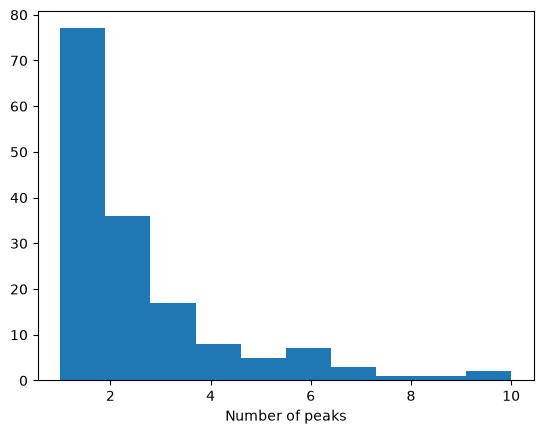
    
  - *High correlation:* The following three plots showed some of the highest levels of correlation, and similar plots were included in Alexander Warmuth's slides for the STIX workshop, showing very similar results for a different set of flares.

    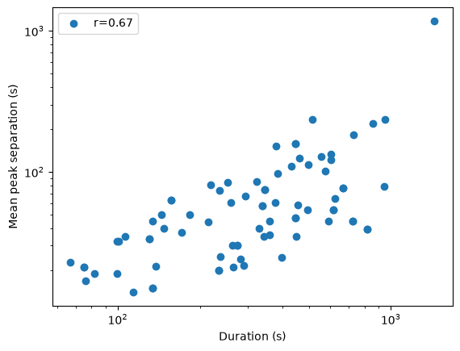
    
    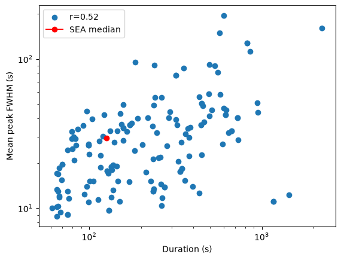

    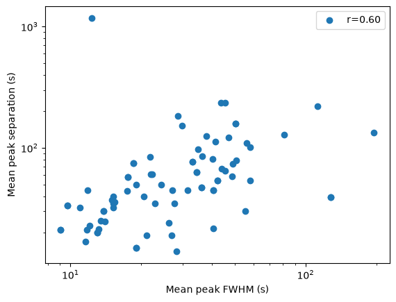

  - *Other plots:* 

    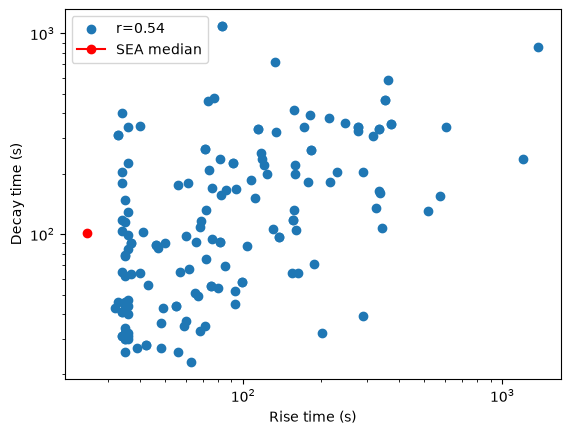

    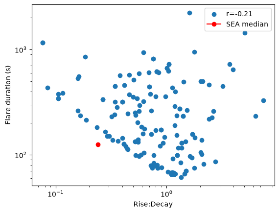

    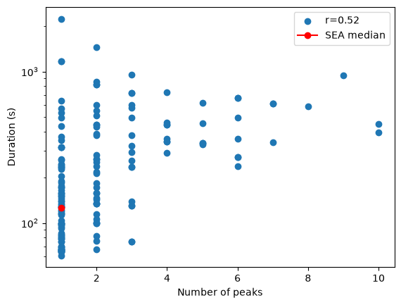

    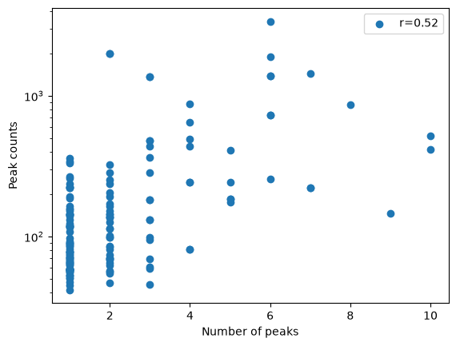

[Back to list](index)
