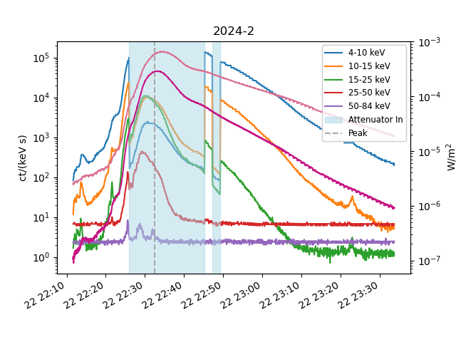
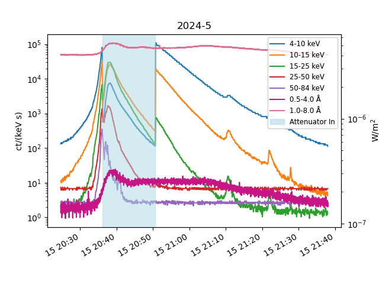
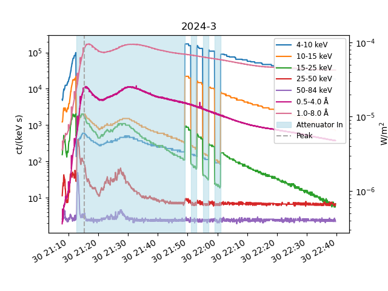
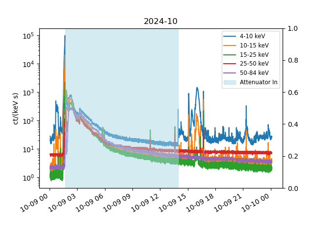
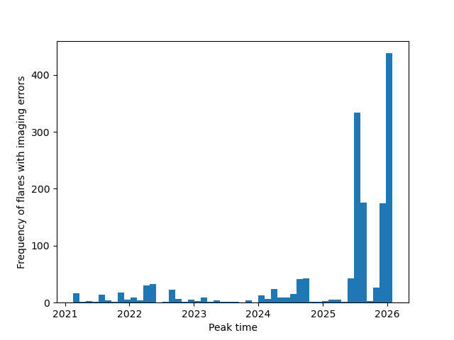
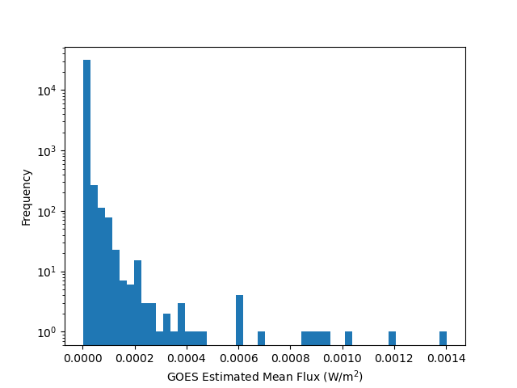
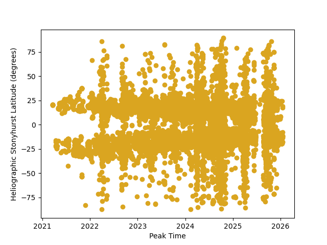
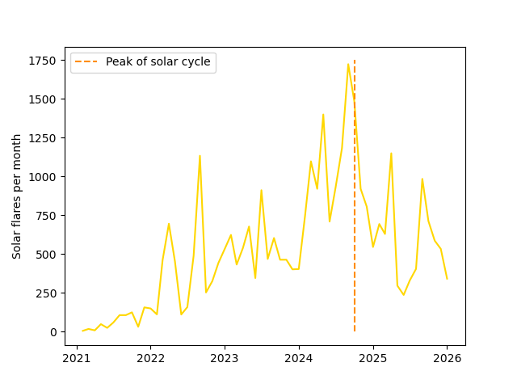

## **Week 2**

#### Tasks completed:
- Created a python function that takes a start and end time, find the corresponding STIX and GOES data, time shifts the STIX data, and plots the lighcurves on the same axes, as well as marking in the peak and shading in attenuator regions
- Tested this function by plotting several flares and looking at any interesting results
- Examined the flare list in more detail; looked at the GOES estimated flux, imaging errors, monthly flare rate, and backside flares.

#### Results/Figures:
- ##### Plot flare function:
    - An example of the plotting function, used on one of the largest flares:
      
      

    - Plotting function used on a flare not visible from Earth - still small peaks visible in GOES (large flare)
 
      
 
    - An example where the attenuator doesn't function as intented - repeatedly comes in and out
 
      
 
    - Another example with the attenuator, and plotting over a larger period (multiple flares) - it was on continuously for ~12 hours after the largest flare
 
      
      
- ##### Flare list analysis:
    - *GOES Estimated Flux:*
 
      xxx
        
    - *Imaging Errors:*
        - 1,572 out of a total 31,730 flares have errors with imaging, causing them to have no location (hgs_lon) in the flare list. Large clusters of imaging errors occur in summer of 2025 and in late 2025/ early 2026.
      
      
      
    - *Size distribution: How rare are large flares?*
      - The histogram below shows the frequency of flares by estimated goes flux on a log scale.
      
      
 
      - Smaller flares are drastically more common - of the flares in the list, less than 5% are M or X by the estimated GOES class. 

      
    - *Backside flares: How many are not visible from Earth, and are any of them large?*
      - 14,949 flares out of 31,730 occurred on the back side of the Sun and were therefore not visible from Earth. Examining the relative occurence of larger flares (M or X class), using the GOES estimated mean class:
        
        || Visible from Earth | Not visible from Earth |
        |--------|:-:|:-:|
        | *Number of M class* | 685 | 682 |
        | *Number of X class* | 42 | 80 |
        
      - There are almost double the number of X class flares on the back side of the Sun.
     
    - *Butterfly diagram: Do flares drift towards the equator over the mission?*
      - From the plot, there is a clear narrowing in the shape that indicates there is an overall drifting of flares towards the equator over the course of the 5 years. However, although the majority of flares seem to drift towards the centre, the flares also seem to be less concentrated in the vicinity, with more flares at extreme latitudes towards the end of the period than at the beginning. 
      
      
      
    - *Flare rate over time: Does the count per month climb with the solar cycle?*
      - Although there are quite large variations in the monthly rate of flares over the period, there is a clear peak in the number around the maximum of this solar cycle (October 2024) and there seems to be an overall climb to this point and decrease afterwards. 
      
      
        
[Back to list](index)