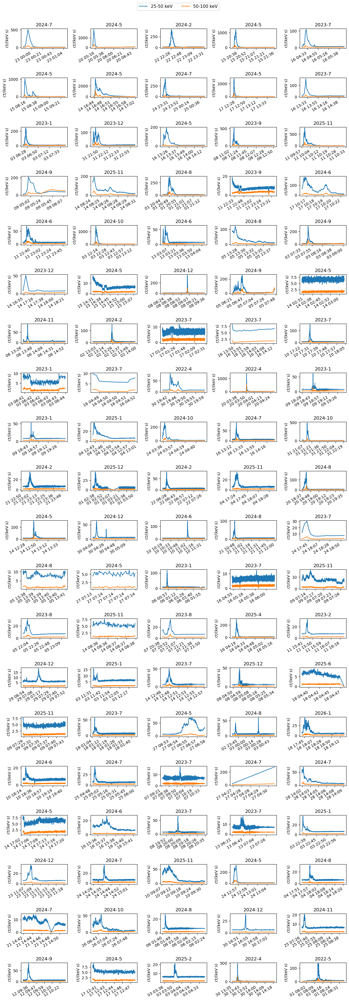

## **Week 3**

#### Tasks completed:
- Made plots of the 100 largest flares from the flare list using STIX quicklook data by GOES estimated flux in the hard x-ray (25-50 and 50-100 keV bands).
- Became familiar with accessing and working with STIX science data.
- Plotted the 100 largest flares using the science data and compared to quicklook.
- Started statistical analysis of the 100 flares.

#### Results/Figures:
- ##### Flare plots:
     
   - Possible improvements to be made: files not currently checked for resolution - some plots visibly lower resolution, bad for comparing stats.

- ##### Statistics:
    |    |   flare_list_id |   number_of_peaks |   rise_time |   decay_time |   total_duration | strong_hard_x-ray   | comments          |
    |---:|----------------:|------------------:|------------:|-------------:|-----------------:|:--------------------|:------------------|
    |  0 |           17678 |                 1 |           0 |            0 |                0 | True                |                   |
|  1 |           16121 |                 1 |           0     |            0 |                0 | True                |                   |
|  2 |           12921 |                13 |           0 |            0 |                0 | True                |                   |
|  3 |           15873 |                 5 |           0 |            0 |                0 | True                |                   |
|  4 |            8972 |                 1 |           0 |            0 |                0 | True                |                   |
|  5 |           15844 |                 2 |           0 |            0 |                0 | True                |                   |
|  6 |           15798 |                10 |           0 |            0 |                0 | True                |                   |
|  7 |           17775 |                11 |           0 |            0 |                0 | True                |                   |\n|  8 |           15985 |                 4 |           0 |            0 |                0 | True                |                   |\n|  9 |            9007 |                 1 |           0 |            0 |                0 | True                |                   |\n| 10 |            5513 |                 8 |           0 |            0 |                0 | True                |                   |\n| 11 |           11949 |                 3 |           0 |            0 |                0 | True                | possible pulses   |\n| 12 |           15918 |                 1 |           0 |            0 |                0 | True                |                   |\n| 13 |           10165 |                10 |           0 |            0 |                0 | True                |                   |\n| 14 |           30536 |                10 |           0 |            0 |                0 | True                |                   |\n| 15 |           19665 |                 1 |           0 |            0 |                0 | True                |                   |\n| 16 |           30637 |                 3 |           0 |            0 |                0 | True                |                   |\n| 17 |           18238 |                 6 |           0 |            0 |                0 | True                | possible pulses   |\n| 18 |           10252 |                 0 |           0 |            0 |                0 | False               | wrong time range? |\n| 19 |           16865 |                 2 |           0 |            0 |                0 | True                |                   |\n| 20 |           16710 |                 3 |           0 |            0 |                0 | True                | possible pulses   |\n| 21 |           21278 |                 6 |           0 |            0 |                0 | True                |                   |\n| 22 |           16752 |                 3 |           0 |            0 |                0 | True                | possible pulses   |\n| 23 |           18432 |                 2 |           0 |            0 |                0 | True                |                   |\n| 24 |           19400 |                 4 |           0 |            0 |                0 | True                |                   |\n| 25 |           11730 |                 1 |           0 |            0 |                0 | True                |                   |\n| 26 |           15856 |                 2 |           0 |            0 |                0 | True                |                   |\n| 27 |           23607 |                 1 |           0 |            0 |                0 | True                |                   |\n| 28 |           19491 |                21 |           0 |            0 |                0 | True                | possible pulses   |\n| 29 |           15754 |                 0 |           0 |            0 |                0 | False               |                   |\n| 30 |           22906 |                 1 |           0 |            0 |                0 | True                |                   |\n| 31 |           12385 |                 3 |           0 |            0 |                0 | True                |                   |\n| 32 |            9046 |                 9 |           0 |            0 |                0 | False               |                   |\n| 33 |            9008 |                 1 |           0 |            0 |                0 | False               |                   |\n| 34 |            8812 |                 2 |           0 |            0 |                0 | True                |                   |\n| 35 |            5514 |                 8 |           0 |            0 |                0 | False               |                   |\n| 36 |            8973 |                 1 |           0 |            0 |                0 | False               |                   |\n| 37 |            2102 |                 1 |           0 |            0 |                0 | True                |                   |\n| 38 |            2060 |                 1 |           0 |            0 |                0 | True                |                   |\n| 39 |            5639 |                 2 |           0 |            0 |                0 | True                |                   |\n| 40 |            5640 |                 2 |           0 |            0 |                0 | True                |                   |\n| 41 |           24372 |                 1 |           0 |            0 |                0 | True                |                   |\n| 42 |           22177 |                 4 |           0 |            0 |                0 | True                | possible pulses   |\n| 43 |           17486 |                 2 |           0 |            0 |                0 | True                |                   |\n| 44 |           22548 |                 3 |           0 |            0 |                0 | True                |                   |\n| 45 |           12890 |                 1 |           0 |            0 |                0 | True                |                   |\n| 46 |           30855 |                 2 |           0 |            0 |                0 | True                |                   |\n| 47 |           12903 |                 3 |           0 |            0 |                0 | True                |                   |\n| 48 |           30331 |                 1 |           0 |            0 |                0 | True                |                   |\n| 49 |           18944 |                 4 |           0 |            0 |                0 | True                | possible pulses   |\n| 50 |           15783 |                 3 |           0 |            0 |                0 | True                |                   |\n| 51 |           24196 |                 2 |           0 |            0 |                0 | True                |                   |\n| 52 |           16647 |                 1 |           0 |            0 |                0 | True                |                   |\n| 53 |           18991 |                 3 |           0 |            0 |                0 | True                |                   |\n| 54 |            9370 |                 1 |           0 |            0 |                0 | True                |                   |\n| 55 |           18433 |                 2 |           0 |            0 |                0 | False               |                   |\n| 56 |           16442 |                 2 |           0 |            0 |                0 | False               |                   |\n| 57 |            5547 |                 2 |           0 |            0 |                0 | True                |                   |\n| 58 |            8974 |                 6 |           0 |            0 |                0 | False               |                   |\n| 59 |           30475 |                 0 |           0 |            0 |                0 | True                |                   |\n| 60 |            9668 |                 1 |           0 |            0 |                0 | True                |                   |\n| 61 |           30638 |                 3 |           0 |            0 |                0 | False               |                   |\n| 62 |            9743 |                 1 |           0 |            0 |                0 | True                |                   |\n| 63 |           26858 |                 8 |           0 |            0 |                0 | True                |                   |\n| 64 |            6201 |                 1 |           0 |            0 |                0 | True                |                   |\n| 65 |           24133 |                 0 |           0 |            0 |                0 | True                |                   |\n| 66 |           24342 |                 0 |           0 |            0 |                0 | True                |                   |\n| 67 |            8927 |                 2 |           0 |            0 |                0 | True                |                   |\n| 68 |           31028 |                 1 |           0 |            0 |                0 | True                |                   |\n| 69 |           27709 |                 2 |           0 |            0 |                0 | False               |                   |\n| 70 |           30476 |                 0 |           0 |            0 |                0 | False               |                   |\n| 71 |            9100 |                 1 |           0 |            0 |                0 | True                |                   |\n| 72 |           16441 |                 2 |           0 |            0 |                0 | True                |                   |\n| 73 |           18320 |                 2 |           0 |            0 |                0 | True                |                   |\n| 74 |           31580 |                 4 |           0 |            0 |                0 | True                | possible pulses   |\n| 75 |           16662 |                 1 |           0 |            0 |                0 | True                |                   |\n| 76 |           17787 |                 1 |           0 |            0 |                0 | True                |                   |\n| 77 |            8717 |                 0 |           0 |            0 |                0 | True                |                   |\n| 78 |           17859 |                 1 |           0 |            0 |                0 | True                |                   |\n| 79 |           17935 |                 1 |           0 |            0 |                0 | True                |                   |\n| 80 |           15799 |                10 |           0 |            0 |                0 | False               |                   |\n| 81 |           16837 |                 1 |           0 |            0 |                0 | True                |                   |\n| 82 |            8745 |                 2 |           0 |            0 |                0 | True                |                   |\n| 83 |            8890 |                 0 |           0 |            0 |                0 | True                |                   |\n| 84 |           24354 |                 2 |           0 |            0 |                0 | True                |                   |\n| 85 |           23889 |                 1 |           0 |            0 |                0 | True                |                   |\n| 86 |           17750 |                 1 |           0 |            0 |                0 | True                |                   |\n| 87 |           30496 |                 2 |           0 |            0 |                0 | True                | possible pulses   |\n| 88 |           16352 |                 1 |           0 |            0 |                0 | True                |                   |\n| 89 |           18407 |                 1 |           0 |            0 |                0 | True                |                   |\n| 90 |           17633 |                 0 |           0 |            0 |                0 | False               |                   |\n| 91 |           22261 |                 4 |           0 |            0 |                0 | True                | possible pulses   |\n| 92 |           18455 |                 1 |           0 |            0 |                0 | True                |                   |\n| 93 |           24215 |                 1 |           0 |            0 |                0 | True                |                   |\n| 94 |           23346 |                 0 |           0 |            0 |                0 | True                |                   |\n| 95 |           19855 |                 2 |           0 |            0 |                0 | True                |                   |\n| 96 |           15986 |                 4 |           0 |            0 |                0 | False               |                   |\n| 97 |           24906 |                 1 |           0 |            0 |                0 | True                |                   |\n| 98 |            2083 |                 5 |           0 |            0 |                0 | True                |                   |\n| 99 |            2130 |                 0 |           0 |            0 |                0 | True                |                   |

[Back to list](index)