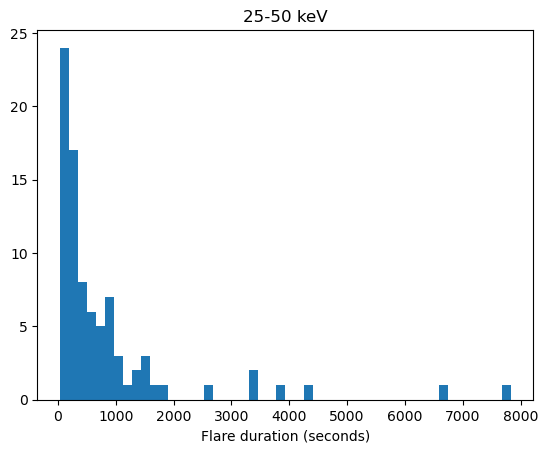
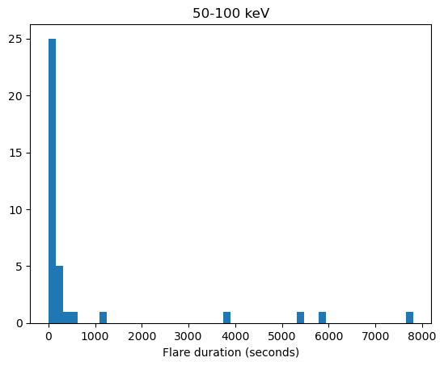
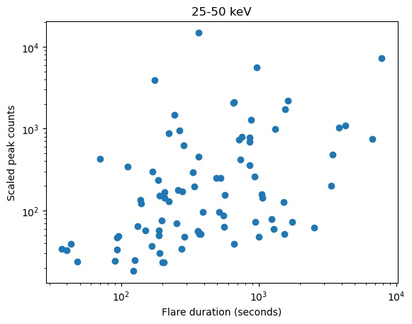
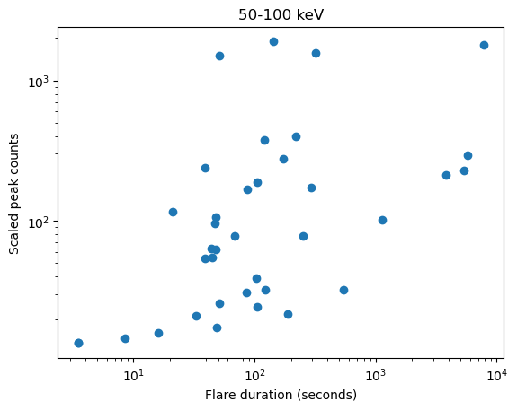
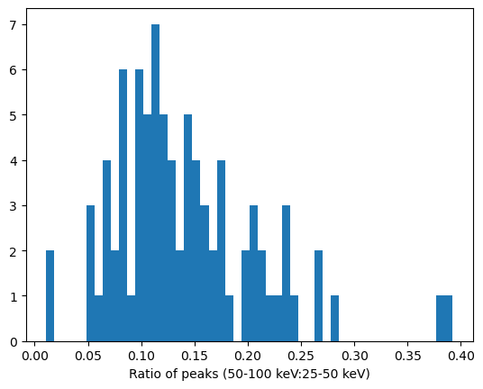
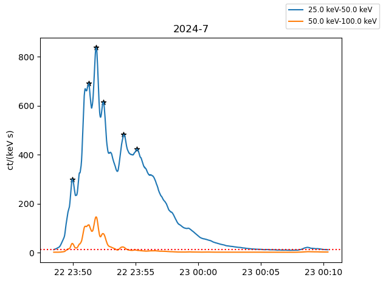
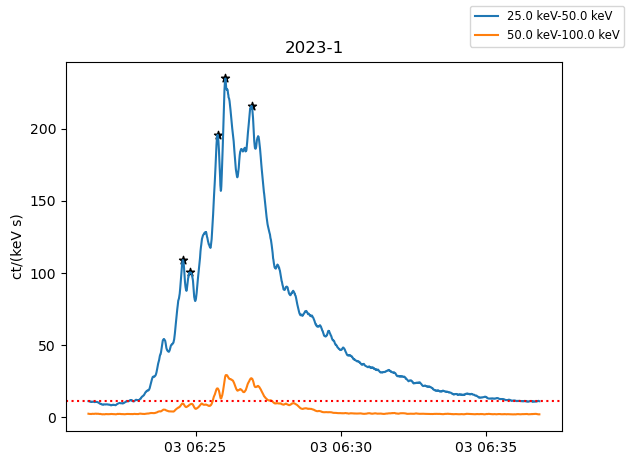

## **Week 4**

#### Tasks completed:
- Continued working with science data plots of the top 100 flares - moved to spectogram data
- Worked on statistics dataframe, added rise and decay times using flare start/ends based on a 10 count line (with counts scaled as 1/r^2 where r=solar orbiter dist. from Sun in AU)
- Started some basic statistical analysis, looking at distribution of flare durations in the 25-50 and 50-100 keV bands, peak counts as a function of duration, and the ratio of the energy band peaks
- Used a Savitzky-Golay filter to smooth the data, to hopefully get more accurate starts/ends and peak locations
- Redid plots and statistics with smoothed filter

#### Results/Figures:
- ##### Statistics (smoothed data):
  
  
  
  
  

  - Smoothing the data made only subtle differences in the appearance of these plots - although there is an increase in the clustering of durations towards the shorter times and in the peak counts as a function of duration towards the centre. The most common duration in the 25-50 keV band is around 4 minutes, and slightly shorter in the higher energy band. There appears to be some level of correlation between the duration and peak counts - it would be intersting to see if this holds for a larger data set.

- ##### Example plots:
  
  
 - Stars mark peaks found by Scipy find_peaks. The prominence level of this might need too be reduced for the filtered data, as it seems to be somewhat undercounting now (it was previously overcounting on many)
- Some of the plots, especially of smaller flares, seem too smoothed - smoothing is currently being applied equally to all plots, but might need to be adjusted flare by flare - could use e.g. peak counts, or some better criteria for noise level?

#### Aims/questions for next week:
- Adjust smoothing of flare data
- Adjust peak finding to fit smoothed data, and possibly try new methods
- Currently, the same start/end criteria (10 counts scaled) used for both bands - is it sensible to lower this for the higher energies, as the peaks tend to be much lower, and there is currently no flare registered for the majority of them, even though some of these do have a small peak (just <10 scaled counts)
- Continue statistical analysis - what are other interesting properties to look at?

[Back to list](index)