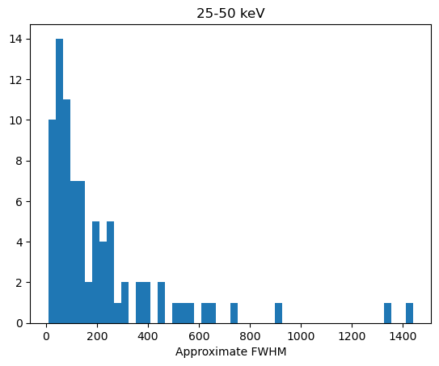
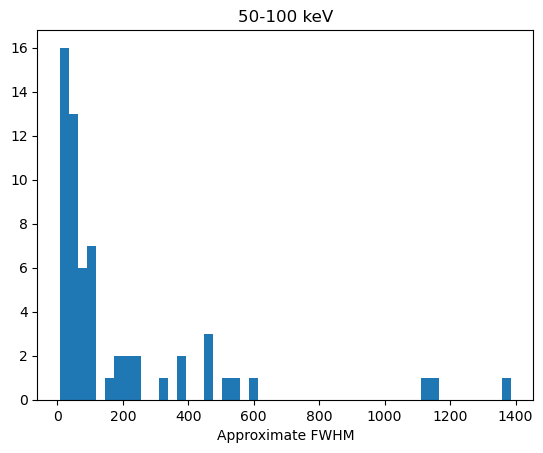
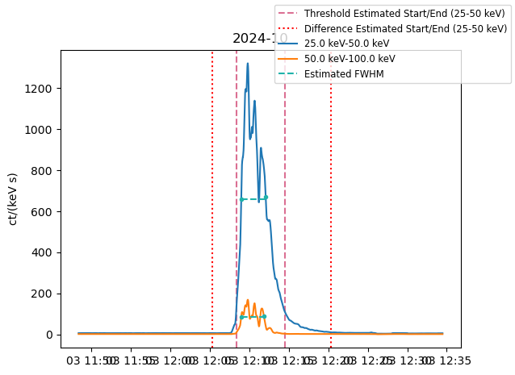

## **Week 4**

#### Tasks completed:
- Submitted abstract for STIX workshop
- Continued testing smoothing and peak finding on flare data
- Added start and end times to statistics dataframe
- Measured approximate FWHM of flares in the 25-50 keV and 50-100 keV bands and compared to flare durations
- Tested alternative method for finding flare starts and ends with difference in counts
- Identified several interestingly shaped flares and compared to quicklook data (?)

#### Results/Figures:
- ##### FWHM:
 - Currently estimated by finding 1/2 of the peak counts and measuring from the point where the flare reaches this number of counts to the last part of the flare at this level - i.e. measuring across the entire 'shape' of the flare, even if there are multiple peaks
 - Very rough estimate, and some innacuracies visible from the fact that there isn't currently any interpolation of the flare data- so it is finding the nearest point to the half maximum on either 'end'
   
   
 - From looking at the distribution of the FWHMs as well as visually marking them on the flare plots, they appeared to be a very similar length, or in some cases longer, than the 10 keV/3 keV (for the 25-50 and 50-100 keV bands respectively) threshold durations. While this makes some sense because the increase/decrease from the half maximum point is very steep in most of the flares, I wanted to try and get a more accurate estimate of the duration vs the fwhm. By definition, looking at a 'threshold' of counts for the start time is going to neglect the increase or decrease just above/below the line, which should be included for the most accurate rise/decay time.

- ##### Difference method for estimating flare times:
   - I experimented with using a method of identifying where the flare counts start to increase/decrease by a given amount - by trial and error, this is currently looking for where the absolute value of the difference between points is > 0.1 counts, with heavily smoothed data
   - Currently, I have this getting reasonably accurate starts and ends for approx. 50 of the flares - of the top 100, the other half either have very low counts/weak signal in the hard x-ray, or are very impulsive and therefore the current smoothing is not accurately getting the flare shape (it is probably possible to apply the same method to these flares just with less/no smoothing, however I'm not sure about extending this to a larger dataset it in terms of automating the process). There are also some flares that have other small flares occuring very close in time to the flare of interest - I am trying to figure out what is the best way of 'focusing in on' the main flare, either by using some other estimated start/end times to constrain the time period being analysed, or having some system of checking for areas of change that contain the main peak. 
     
     
   - For the subset of flares where I currently have the durations estimated using the differences, the first histogram above shows the difference method durations, and the second the threshold methods. The difference method gives over all longer durations, and by eye more accurate, although there is still some issues for some of the flares, mainly with the end values cutting off too soon.
   - Below is an example with the FWHM marked (turquoise), and the starts and ends in the two different methods.
     

#### Aims/questions for next week:

[Back to list](index)
