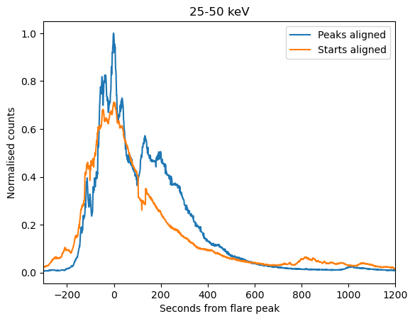
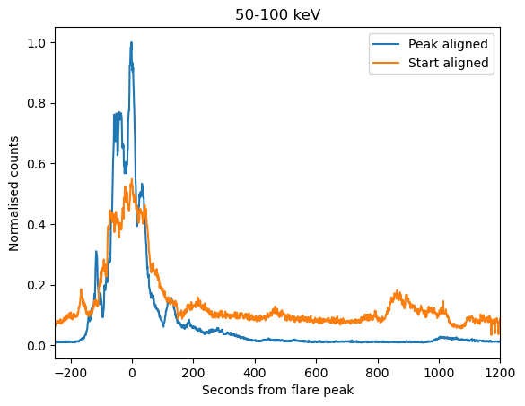

## **Week 6**

#### Tasks completed:
- Made additional plots + calculated Spearman and Pearson correlation coefficients
- SEA
- Started tidying code + converting to functions
- Submitted abstract for INAM

#### Results/Figures:
- ##### Finalised duration method:
  - Using difference method with >0.05 counts for 25-50 keV >0.02 counts for 50-100 keV. Tested this for SEA and it returned a much better shape than the threshold method.
    
    

- ##### SEA:
  - Superimposed epoch analysis of top flares by GOES estimated flux. Due to low counts and difficulties with getting accurate start times for some flares, top 100 were narrowed down to top 45. It would be good to try and do this with a larger number -  possibly by taking top flares by 25-50 keV counts instead. With this reduced flare set,  the SEA results for both have a similar shape, and some fluctuations are visible in both energy ranges.
   
    

    
  
[Back to list](index)