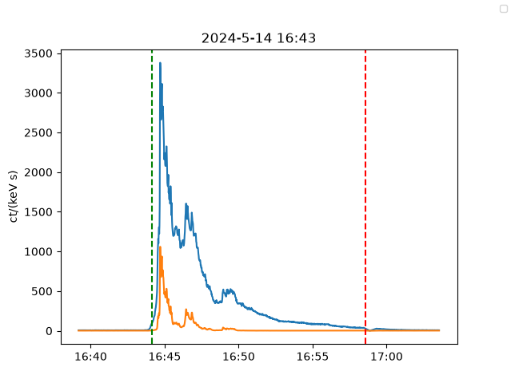
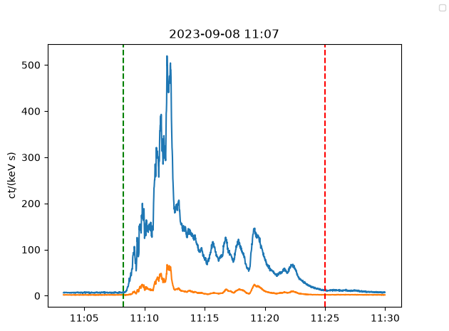
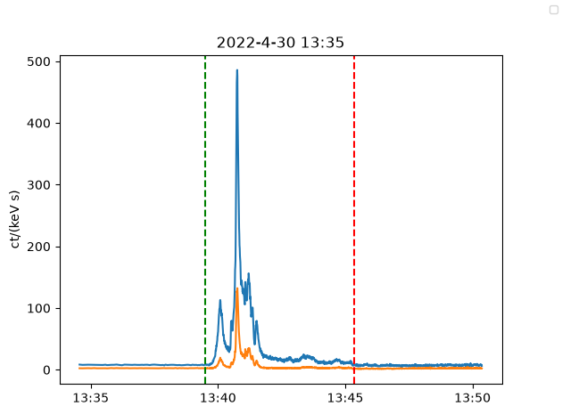
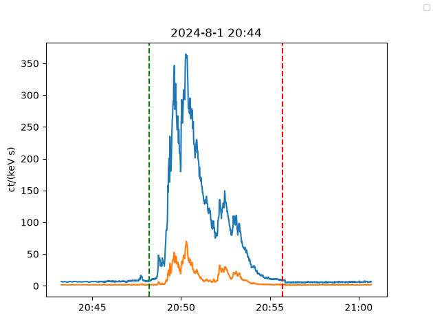
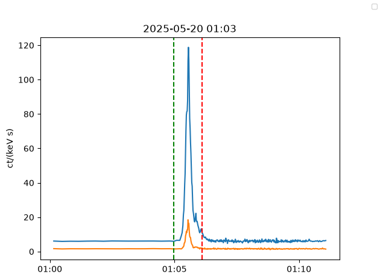
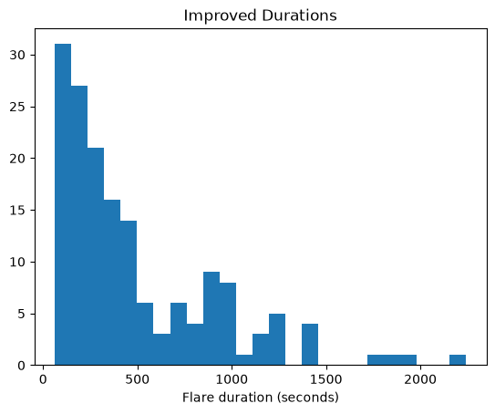
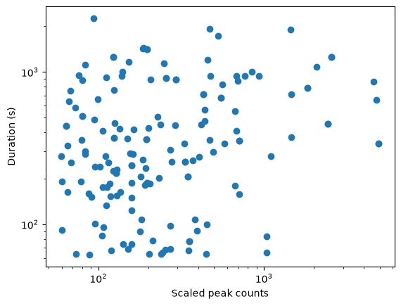
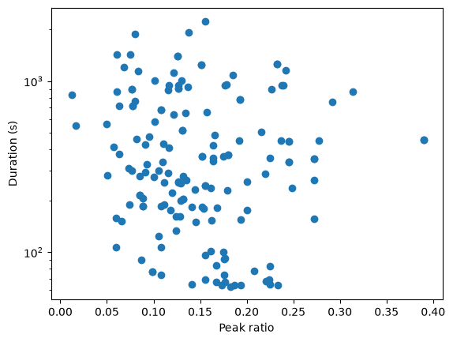
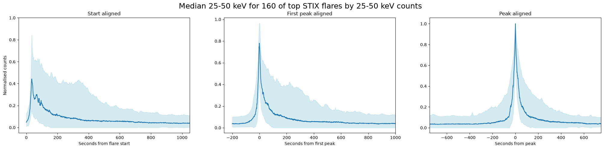

## **Week 9**

#### Tasks completed:
- Improved flare duration/start and end time estimations
- Repeated SEA with improved start times, also did aligning first peak in flare
- Remade correlation plots with improved durations

#### Results/Figures:
- ##### Improved duration method:
  - Smoothing with window size = 75
  - For start - finding difference >0.2 counts *and* following 20 points must be monotonically increasing
  - For end - when flare goes below mean count value (in *entire* flare timeseries file)
    
  - Examples:

    

    

    

    

    

- ##### Remade duration plots:

    

    

  - Spearman correlation coefficient = 0.2

    
    
  - Spearman correlation coefficient = -0.1

- ##### SEA:
  - SEA aligned to *first* peak in flare (using Scipy find_peaks with a prominence of 5% of the peak counts)
  - Start-aligned SEA redone with improved start times
  - All 3 methods extended to include 160 of the top 400 flares from flare list by 25-50 keV counts
    
  - Comparison of the three SEA methods:
   
    

[Back to list](index)
